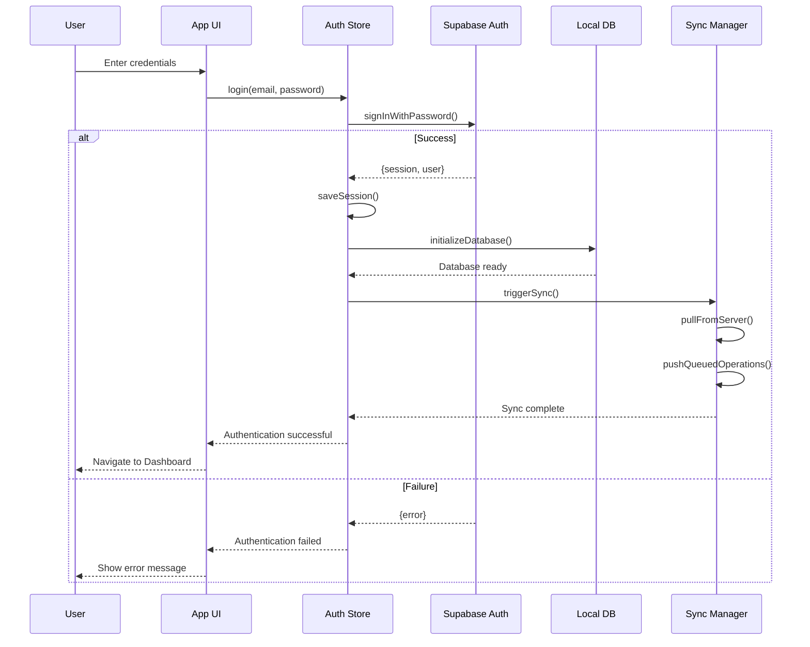
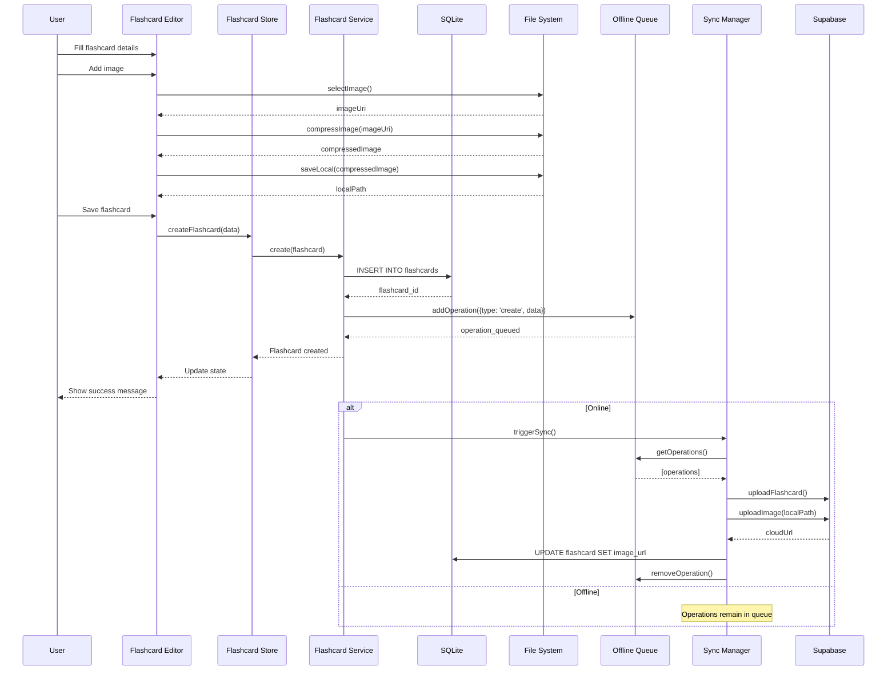
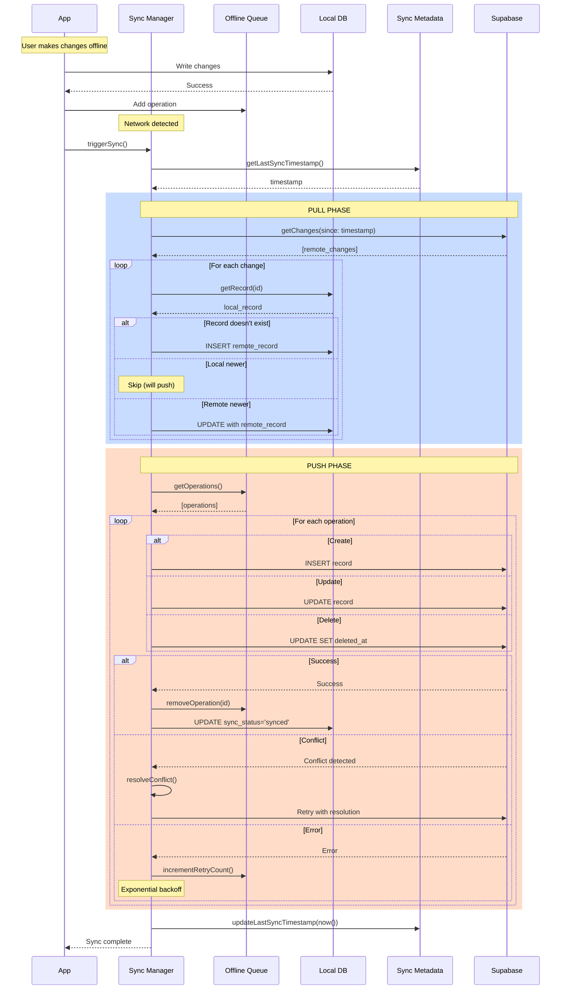

# Flashcard Mobile App - Architecture Documentation

## Table of Contents
1. [System Overview](#system-overview)
2. [Use Cases](#use-cases)
3. [Sequence Diagrams](#sequence-diagrams)
4. [Architecture Patterns](#architecture-patterns)
5. [Design Principles](#design-principles)
6. [Data Flow](#data-flow)
7. [Security Architecture](#security-architecture)
8. [Performance Considerations](#performance-considerations)

---

## System Overview

The Flashcard Mobile App is a cross-platform mobile application built using an **offline-first architecture** with cloud synchronization. It implements the **SM-2 spaced repetition algorithm** for optimal learning and retention.

### Architecture Style
- **Offline-First Architecture**: Local data is the source of truth
- **Clean Architecture**: Separation of concerns with clear boundaries
- **Repository Pattern**: Data access abstraction layer
- **MVVM with Hooks**: UI layer pattern using React hooks and Zustand stores

### Technology Stack Summary
```
┌─────────────────────────────────────────┐
│         Presentation Layer              │
│   React Native + TypeScript + Paper     │
└─────────────────────────────────────────┘
                    ↓
┌─────────────────────────────────────────┐
│       State Management Layer            │
│     Zustand Stores + React Query        │
└─────────────────────────────────────────┘
                    ↓
┌─────────────────────────────────────────┐
│         Business Logic Layer            │
│  Services + Algorithms + Validators     │
└─────────────────────────────────────────┘
                    ↓
┌─────────────────────────────────────────┐
│          Data Access Layer              │
│   Repository Pattern + SQLite + Sync    │
└─────────────────────────────────────────┘
                    ↓
┌─────────────────────────────────────────┐
│         Storage & Backend               │
│   Local SQLite <--Sync--> Supabase      │
└─────────────────────────────────────────┘
```

---

## Use Cases

### 1. User Authentication & Onboarding

#### UC-001: User Registration
**Actors:** New User
**Preconditions:** None
**Postconditions:** User account created, authenticated, and onboarded

**Main Flow:**
1. User opens the app for the first time
2. System displays onboarding screens
3. User provides email and password
4. System validates credentials
5. System creates user account in Supabase
6. System authenticates user and stores session token securely
7. System initializes local database
8. System displays dashboard

**Alternative Flows:**
- 3a. User chooses to continue without account (local-only mode)
- 4a. Invalid credentials → Show validation errors
- 5a. Network error → Store credentials and retry when online

---

#### UC-002: User Login
**Actors:** Registered User
**Preconditions:** User has existing account
**Postconditions:** User authenticated and data synced

**Main Flow:**
1. User enters email and password
2. System validates credentials with Supabase
3. System retrieves and stores authentication token
4. System triggers background sync
5. System navigates to dashboard

**Alternative Flows:**
- 2a. Invalid credentials → Show error message
- 2b. Network unavailable → Allow offline access if previously logged in
- 4a. Sync conflicts detected → Apply conflict resolution strategy

---

### 2. Flashcard Management

#### UC-003: Create Flashcard
**Actors:** User
**Preconditions:** User is authenticated
**Postconditions:** Flashcard created in local database and queued for sync

**Main Flow:**
1. User navigates to "Add Flashcard" screen
2. User selects category
3. User enters question text
4. User enters answer text
5. User optionally adds multimedia (image/audio)
6. System validates input
7. System saves flashcard to local SQLite database
8. System adds operation to offline sync queue
9. System triggers background sync (if online)
10. System displays success message

**Alternative Flows:**
- 5a. User adds image → System compresses and stores locally
- 5b. User records audio → System saves in M4A format locally
- 6a. Validation fails → Display error messages
- 9a. Offline → Operation remains in queue
- 9b. Sync fails → Retry with exponential backoff

---

#### UC-004: Edit Flashcard
**Actors:** User
**Preconditions:** Flashcard exists
**Postconditions:** Flashcard updated and synced

**Main Flow:**
1. User selects flashcard from library
2. User taps edit button
3. System loads current flashcard data
4. User modifies fields
5. System validates changes
6. System updates flashcard in local database
7. System updates `updated_at` timestamp
8. System queues update operation for sync
9. System triggers background sync

**Alternative Flows:**
- 8a. Conflict detected during sync → Apply last-write-wins strategy
- 8b. Version mismatch → Prompt user to resolve conflict

---

#### UC-005: Delete Flashcard
**Actors:** User
**Preconditions:** Flashcard exists
**Postconditions:** Flashcard soft-deleted and synced

**Main Flow:**
1. User long-presses flashcard or swipes
2. System displays delete confirmation dialog
3. User confirms deletion
4. System sets `deleted_at` timestamp (soft delete)
5. System updates sync queue
6. System removes flashcard from UI
7. System triggers background sync

**Alternative Flows:**
- 3a. User cancels → No action taken
- 6a. Sync fails → Keep in queue for later

---

### 3. Study Mode & Spaced Repetition

#### UC-006: Start Study Session
**Actors:** User
**Preconditions:** User has flashcards in selected category
**Postconditions:** Study session created and progress tracked

**Main Flow:**
1. User selects category or "All Cards"
2. User chooses study mode (New, Review, Mixed)
3. System queries flashcards based on selection:
   - New: Cards never reviewed
   - Review: Cards with `next_review_date <= today`
   - Mixed: Combination of both
4. System applies SM-2 algorithm to prioritize cards
5. System creates study session record
6. System displays first flashcard (question side)
7. User taps to flip card (reveal answer)
8. User rates difficulty (0-5)
9. System calculates next review interval using SM-2
10. System updates flashcard metadata
11. System records review in `study_session_cards`
12. System displays next card
13. Repeat steps 7-12 until session complete
14. System ends session and displays summary

**Alternative Flows:**
- 3a. No cards due for review → Suggest creating new cards or cramming mode
- 8a. User skips card → Mark as skipped, don't update metadata
- 13a. User exits early → Save partial session progress

---

#### UC-007: SM-2 Algorithm Execution
**Actors:** System
**Preconditions:** User rates flashcard difficulty
**Postconditions:** Next review interval calculated

**Algorithm Flow:**
```
Input:
  - quality: User rating (0-5)
  - previous_interval: Days since last review
  - previous_repetitions: Number of successful reviews
  - previous_efactor: Easiness factor (1.3-2.5)

Process:
1. If quality >= 3:
   - If repetitions = 0: interval = 1 day
   - If repetitions = 1: interval = 6 days
   - If repetitions > 1: interval = previous_interval × efactor
   - repetitions++
2. If quality < 3:
   - repetitions = 0
   - interval = 1 day
3. Calculate new efactor:
   - efactor = previous_efactor + (0.1 - (5 - quality) × (0.08 + (5 - quality) × 0.02))
   - Clamp efactor between 1.3 and 2.5
4. Calculate next_review_date = today + interval

Output:
  - New interval
  - New repetitions count
  - New efactor
  - Next review date
```

**Example:**
```
Card with efactor=2.5, repetitions=2, interval=6 days
User rates: Quality = 4 (Correct with hesitation)

Calculation:
- quality >= 3, so continue
- repetitions > 1: interval = 6 × 2.5 = 15 days
- repetitions = 3
- efactor = 2.5 + (0.1 - (5-4) × (0.08 + (5-4) × 0.02)) = 2.5 + 0.0 = 2.5
- next_review_date = today + 15 days

Result: Card will be shown again in 15 days
```

---

### 4. Quiz Mode

#### UC-008: Generate and Take Quiz
**Actors:** User
**Preconditions:** Category has at least 4 flashcards
**Postconditions:** Quiz completed and results saved

**Main Flow:**
1. User selects "Quiz Mode"
2. User selects category and number of questions
3. User chooses quiz type (multiple choice or typed)
4. System randomly selects flashcards
5. For each question:
   - System displays question
   - If multiple choice: Generate 3 distractors from other answers
   - System shuffles options
   - User selects/types answer
   - System validates answer
   - System shows correct/incorrect feedback
6. System calculates final score
7. System saves quiz result to database
8. System displays results summary with:
   - Score percentage
   - Time taken
   - Correct/incorrect breakdown
9. System offers to review incorrect answers

**Alternative Flows:**
- 4a. Insufficient cards → Display error message
- 5a. Timeout reached → Auto-submit current answer
- 9a. User reviews incorrect → Enter study mode for those cards

---

### 5. Progress Tracking

#### UC-009: View Progress Statistics
**Actors:** User
**Preconditions:** User has study history
**Postconditions:** Statistics displayed

**Main Flow:**
1. User navigates to Progress tab
2. System queries study sessions and quiz results
3. System calculates metrics:
   - Total cards studied
   - Cards mastered (efactor > 2.3, repetitions > 3)
   - Average accuracy
   - Study streak (consecutive days)
   - Time spent studying
   - Category-wise breakdown
4. System generates charts:
   - Line chart: Progress over time
   - Bar chart: Category comparison
   - Pie chart: Category distribution
   - Calendar heatmap: Study activity
5. System displays statistics and charts
6. User can filter by time period (week/month/year)

**Alternative Flows:**
- 2a. No study history → Display empty state with encouragement
- 6a. User changes filter → Recalculate and update display

---

### 6. Data Synchronization

#### UC-010: Offline-First Sync
**Actors:** System
**Preconditions:** User has internet connection
**Postconditions:** Local and remote data synchronized

**Main Flow:**
1. System detects network connectivity
2. System retrieves last sync timestamp from `sync_metadata`
3. **PULL PHASE:**
   - System fetches changes from Supabase (timestamp-based)
   - For each remote change:
     - System checks if local record exists
     - If not exists: Insert locally
     - If exists and remote newer: Update locally
     - If exists and local newer: Skip (will push later)
4. **PUSH PHASE:**
   - System retrieves operations from `offline_queue`
   - For each queued operation:
     - System executes operation on Supabase
     - If successful: Remove from queue
     - If conflict: Apply conflict resolution
     - If error: Increment retry count and backoff
5. System updates `sync_metadata` with new timestamp
6. System notifies UI of sync completion

**Alternative Flows:**
- 1a. No connectivity → Queue operations for later
- 4a. Conflict detected → Use last-write-wins with version check
- 4b. Authentication error → Trigger re-authentication
- 4c. Rate limit → Implement exponential backoff

---

### 7. Category Management

#### UC-011: Create and Organize Categories
**Actors:** User
**Preconditions:** User is authenticated
**Postconditions:** Category created and synced

**Main Flow:**
1. User navigates to Categories screen
2. User taps "Add Category"
3. User enters category name and description
4. User selects color and icon
5. System validates input
6. System saves category to local database
7. System queues sync operation
8. System displays updated category list

**Alternative Flows:**
- 5a. Duplicate name → Show warning (allow duplicates)
- 7a. Sync fails → Keep in queue

---

### 8. Multimedia Handling

#### UC-012: Add Image to Flashcard
**Actors:** User
**Preconditions:** User is creating/editing flashcard
**Postconditions:** Image attached and uploaded

**Main Flow:**
1. User taps "Add Image" button
2. System displays options: Camera or Gallery
3. User selects image source
4. System launches appropriate picker
5. User selects/captures image
6. System compresses image (80% quality, max 1920px)
7. System generates unique filename
8. System saves to local file system
9. System stores local file path in database
10. System displays image thumbnail
11. System queues upload to Supabase Storage
12. Background process uploads image
13. System updates database with cloud URL

**Alternative Flows:**
- 3a. Camera permission denied → Show permission prompt
- 12a. Upload fails → Retry with exponential backoff
- 12b. Offline → Queue for later upload

---

## Sequence Diagrams

### 1. User Authentication Flow



---

### 2. Create Flashcard with Multimedia



---

### 3. Study Session with SM-2 Algorithm

```mermaid
sequenceDiagram
    participant User
    participant UI as Study Screen
    participant Store as Study Store
    participant Scheduler as Scheduler
    participant SM2 as SM-2 Algorithm
    participant DB as SQLite
    participant Analytics as Analytics Service

    User->>UI: Start Study Session
    UI->>Store: startSession(category)
    Store->>Scheduler: getDueCards(category)

    Scheduler->>DB: SELECT * WHERE next_review_date <= today
    DB-->>Scheduler: [cards]
    Scheduler-->>Store: studyQueue

    Store->>DB: INSERT INTO study_sessions
    DB-->>Store: session_id

    Store-->>UI: Session initialized

    loop For each card
        UI-->>User: Show question
        User->>UI: Flip card
        UI-->>User: Show answer
        User->>UI: Rate difficulty (0-5)

        UI->>Store: rateCard(quality)
        Store->>SM2: calculateNextReview({
            quality,
            previous_interval,
            previous_repetitions,
            previous_efactor
        })

        SM2->>SM2: Apply SM-2 algorithm
        SM2-->>Store: {
            interval,
            repetitions,
            efactor,
            next_review_date
        }

        Store->>DB: UPDATE flashcard_metadata
        Store->>DB: INSERT INTO study_session_cards

        alt More cards
            Store->>UI: nextCard()
        else Session complete
            Store->>DB: UPDATE study_sessions SET ended_at
            Store->>Analytics: calculateStats()
            Analytics-->>Store: sessionStats
            Store-->>UI: Show summary
            UI-->>User: Display results
        end
    end
```

---

### 4. Offline-First Synchronization Flow



---

### 5. Quiz Generation and Scoring

```mermaid
sequenceDiagram
    participant User
    participant UI as Quiz Screen
    participant Store as Quiz Store
    participant Generator as Quiz Generator
    participant DB as SQLite
    participant Timer as Timer Service

    User->>UI: Start Quiz (category, count)
    UI->>Store: generateQuiz(params)

    Store->>DB: SELECT random flashcards
    DB-->>Store: [flashcards]

    Store->>Generator: generateQuestions(flashcards)

    loop For each flashcard
        alt Multiple Choice
            Generator->>DB: SELECT random answers for distractors
            DB-->>Generator: [distractors]
            Generator->>Generator: shuffle([correct, ...distractors])
        else Typed Answer
            Generator->>Generator: prepareTypedQuestion()
        end
    end

    Generator-->>Store: [questions]
    Store-->>UI: Quiz ready

    UI->>Timer: start()

    loop For each question
        UI-->>User: Show question
        User->>UI: Submit answer
        UI->>Store: checkAnswer(answer)

        alt Correct
            Store->>Store: incrementCorrect()
            UI-->>User: Show ✓ feedback
        else Incorrect
            Store->>Store: incrementIncorrect()
            UI-->>User: Show ✗ feedback
        end
    end

    Timer->>Store: getElapsedTime()
    Timer-->>Store: duration

    Store->>Store: calculateScore()
    Store->>DB: INSERT INTO quiz_results

    Store-->>UI: {
        score,
        correct,
        incorrect,
        duration,
        details
    }

    UI-->>User: Display results

    opt Review incorrect
        User->>UI: Review mistakes
        UI->>Store: getIncorrectCards()
        Store-->>UI: [incorrectCards]
        UI-->>User: Show detailed review
    end
```

---

## Architecture Patterns

### 1. Offline-First Architecture

**Principle:** Local database is the source of truth. All operations work offline first, then sync when online.

**Implementation:**
```typescript
// Write Operation Flow
async function createFlashcard(data: FlashcardInput) {
  // 1. Validate locally
  const validated = validateFlashcard(data);

  // 2. Write to local DB immediately
  const flashcard = await localDB.flashcards.insert(validated);

  // 3. Update UI optimistically
  flashcardStore.add(flashcard);

  // 4. Queue for sync
  await offlineQueue.add({
    type: 'create',
    table: 'flashcards',
    data: flashcard,
  });

  // 5. Trigger sync if online
  if (isOnline()) {
    syncManager.sync();
  }

  return flashcard;
}
```

**Benefits:**
- Always responsive, no network latency
- Works completely offline
- No data loss
- Better user experience

---

### 2. Repository Pattern

**Principle:** Abstract data access logic behind a consistent interface.

**Structure:**
```
services/
  database/
    repositories/
      BaseRepository.ts       # Common CRUD operations
      FlashcardRepository.ts  # Flashcard-specific queries
      CategoryRepository.ts   # Category-specific queries
```

**Implementation:**
```typescript
// Base Repository
abstract class BaseRepository<T> {
  abstract table: string;

  async findById(id: string): Promise<T | null> {
    const result = await db.get(
      `SELECT * FROM ${this.table} WHERE id = ? AND deleted_at IS NULL`,
      [id]
    );
    return result || null;
  }

  async findAll(): Promise<T[]> {
    return db.getAll(
      `SELECT * FROM ${this.table} WHERE deleted_at IS NULL`
    );
  }

  async create(data: Partial<T>): Promise<T> {
    const id = generateId();
    const now = Date.now();

    await db.run(
      `INSERT INTO ${this.table} (id, created_at, updated_at, ...)`,
      [id, now, now, ...]
    );

    return this.findById(id);
  }

  // ... update, delete methods
}

// Specific Repository
class FlashcardRepository extends BaseRepository<Flashcard> {
  table = 'flashcards';

  async findByCategory(categoryId: string): Promise<Flashcard[]> {
    return db.getAll(
      `SELECT * FROM flashcards
       WHERE category_id = ? AND deleted_at IS NULL`,
      [categoryId]
    );
  }

  async findDueForReview(): Promise<Flashcard[]> {
    const now = Date.now();
    return db.getAll(
      `SELECT f.*, m.*
       FROM flashcards f
       JOIN flashcard_metadata m ON f.id = m.flashcard_id
       WHERE m.next_review_date <= ? AND f.deleted_at IS NULL`,
      [now]
    );
  }
}
```

---

### 3. State Management with Zustand

**Principle:** Lightweight, hook-based global state with minimal boilerplate.

**Implementation:**
```typescript
// Flashcard Store
interface FlashcardState {
  flashcards: Flashcard[];
  selectedCategory: string | null;
  isLoading: boolean;

  // Actions
  setFlashcards: (flashcards: Flashcard[]) => void;
  addFlashcard: (flashcard: Flashcard) => void;
  updateFlashcard: (id: string, updates: Partial<Flashcard>) => void;
  deleteFlashcard: (id: string) => void;
}

const useFlashcardStore = create<FlashcardState>((set) => ({
  flashcards: [],
  selectedCategory: null,
  isLoading: false,

  setFlashcards: (flashcards) => set({ flashcards }),

  addFlashcard: (flashcard) =>
    set((state) => ({
      flashcards: [...state.flashcards, flashcard],
    })),

  updateFlashcard: (id, updates) =>
    set((state) => ({
      flashcards: state.flashcards.map((card) =>
        card.id === id ? { ...card, ...updates } : card
      ),
    })),

  deleteFlashcard: (id) =>
    set((state) => ({
      flashcards: state.flashcards.filter((card) => card.id !== id),
    })),
}));

// Usage in component
function FlashcardList() {
  const flashcards = useFlashcardStore((state) => state.flashcards);
  const addFlashcard = useFlashcardStore((state) => state.addFlashcard);

  // Component logic
}
```

---

### 4. Service Layer Pattern

**Principle:** Encapsulate business logic in dedicated service classes.

**Implementation:**
```typescript
// Spaced Repetition Service
class SpacedRepetitionService {
  private sm2Algorithm: SM2Algorithm;
  private scheduler: Scheduler;

  async reviewCard(
    flashcardId: string,
    quality: number
  ): Promise<ReviewResult> {
    // 1. Get current metadata
    const metadata = await this.getMetadata(flashcardId);

    // 2. Calculate next review using SM-2
    const result = this.sm2Algorithm.calculate({
      quality,
      interval: metadata.interval,
      repetitions: metadata.repetitions,
      efactor: metadata.easiness_factor,
    });

    // 3. Update metadata
    await this.updateMetadata(flashcardId, {
      interval: result.interval,
      repetitions: result.repetitions,
      easiness_factor: result.efactor,
      next_review_date: result.nextReviewDate,
      last_reviewed_at: Date.now(),
      total_reviews: metadata.total_reviews + 1,
      correct_reviews: quality >= 3
        ? metadata.correct_reviews + 1
        : metadata.correct_reviews,
    });

    // 4. Return result
    return result;
  }

  async getDueCards(categoryId?: string): Promise<Flashcard[]> {
    return this.scheduler.getDueCards(categoryId);
  }
}
```

---

### 5. Custom Hooks Pattern

**Principle:** Encapsulate stateful logic in reusable hooks.

**Implementation:**
```typescript
// useFlashcards Hook
function useFlashcards(categoryId?: string) {
  const [flashcards, setFlashcards] = useState<Flashcard[]>([]);
  const [loading, setLoading] = useState(true);
  const [error, setError] = useState<Error | null>(null);

  const flashcardService = useMemo(() => new FlashcardService(), []);

  // Load flashcards
  useEffect(() => {
    async function loadFlashcards() {
      try {
        setLoading(true);
        const data = categoryId
          ? await flashcardService.findByCategory(categoryId)
          : await flashcardService.findAll();
        setFlashcards(data);
      } catch (err) {
        setError(err as Error);
      } finally {
        setLoading(false);
      }
    }

    loadFlashcards();
  }, [categoryId, flashcardService]);

  // Create flashcard
  const createFlashcard = useCallback(
    async (data: FlashcardInput) => {
      const flashcard = await flashcardService.create(data);
      setFlashcards((prev) => [...prev, flashcard]);
      return flashcard;
    },
    [flashcardService]
  );

  // Update flashcard
  const updateFlashcard = useCallback(
    async (id: string, updates: Partial<Flashcard>) => {
      const flashcard = await flashcardService.update(id, updates);
      setFlashcards((prev) =>
        prev.map((card) => (card.id === id ? flashcard : card))
      );
      return flashcard;
    },
    [flashcardService]
  );

  // Delete flashcard
  const deleteFlashcard = useCallback(
    async (id: string) => {
      await flashcardService.delete(id);
      setFlashcards((prev) => prev.filter((card) => card.id !== id));
    },
    [flashcardService]
  );

  return {
    flashcards,
    loading,
    error,
    createFlashcard,
    updateFlashcard,
    deleteFlashcard,
  };
}

// Usage
function FlashcardScreen() {
  const { flashcards, loading, createFlashcard } = useFlashcards();

  if (loading) return <LoadingSpinner />;

  return (
    <View>
      {flashcards.map((card) => (
        <FlashcardItem key={card.id} flashcard={card} />
      ))}
    </View>
  );
}
```

---

## Design Principles

### 1. SOLID Principles

#### Single Responsibility Principle (SRP)
Each module has one reason to change.

**Example:**
```typescript
// ❌ Bad: Mixed responsibilities
class FlashcardManager {
  createFlashcard() { /* DB logic */ }
  uploadImage() { /* File upload logic */ }
  calculateNextReview() { /* SM-2 algorithm */ }
}

// ✅ Good: Separated responsibilities
class FlashcardRepository {
  create() { /* DB logic only */ }
  update() { /* DB logic only */ }
}

class ImageService {
  upload() { /* File upload only */ }
  compress() { /* Image processing only */ }
}

class SM2Algorithm {
  calculate() { /* Algorithm only */ }
}
```

#### Open/Closed Principle (OCP)
Open for extension, closed for modification.

**Example:**
```typescript
// Base sync strategy
abstract class SyncStrategy {
  abstract sync(): Promise<void>;
}

// Different implementations
class LastWriteWinsStrategy extends SyncStrategy {
  async sync() {
    // Implementation
  }
}

class ManualResolveStrategy extends SyncStrategy {
  async sync() {
    // Different implementation
  }
}

// Context uses strategy without modification
class SyncManager {
  constructor(private strategy: SyncStrategy) {}

  async performSync() {
    await this.strategy.sync();
  }
}
```

#### Liskov Substitution Principle (LSP)
Derived classes should be substitutable for base classes.

**Example:**
```typescript
abstract class Repository<T> {
  abstract findById(id: string): Promise<T | null>;
  abstract findAll(): Promise<T[]>;
}

// All repositories can be used interchangeably
class FlashcardRepository extends Repository<Flashcard> {
  findById(id: string): Promise<Flashcard | null> { /* ... */ }
  findAll(): Promise<Flashcard[]> { /* ... */ }
}

class CategoryRepository extends Repository<Category> {
  findById(id: string): Promise<Category | null> { /* ... */ }
  findAll(): Promise<Category[]> { /* ... */ }
}
```

#### Interface Segregation Principle (ISP)
Clients shouldn't depend on interfaces they don't use.

**Example:**
```typescript
// ❌ Bad: Fat interface
interface DataService {
  create(): void;
  read(): void;
  update(): void;
  delete(): void;
  export(): void;
  import(): void;
  sync(): void;
}

// ✅ Good: Segregated interfaces
interface Readable {
  read(): void;
}

interface Writable {
  create(): void;
  update(): void;
  delete(): void;
}

interface Syncable {
  sync(): void;
}

interface Exportable {
  export(): void;
  import(): void;
}

// Clients use only what they need
class FlashcardService implements Readable, Writable, Syncable {
  // Implementation
}
```

#### Dependency Inversion Principle (DIP)
Depend on abstractions, not concretions.

**Example:**
```typescript
// ❌ Bad: Direct dependency on concrete class
class StudySession {
  private db = new SQLiteDatabase(); // Concrete dependency

  async saveSession() {
    await this.db.insert(/* ... */);
  }
}

// ✅ Good: Depend on abstraction
interface Database {
  insert(table: string, data: any): Promise<void>;
  query(sql: string): Promise<any>;
}

class StudySession {
  constructor(private db: Database) {} // Abstract dependency

  async saveSession() {
    await this.db.insert('study_sessions', /* ... */);
  }
}

// Can inject any implementation
const session = new StudySession(new SQLiteDatabase());
// or
const session = new StudySession(new MockDatabase());
```

---

### 2. Clean Architecture Principles

#### Layers and Dependencies
```
┌─────────────────────────────────────────┐
│     Presentation (UI/Components)        │ ← React Native, React Native Paper
├─────────────────────────────────────────┤
│      Application (Stores/Hooks)         │ ← Zustand, Custom Hooks
├─────────────────────────────────────────┤
│       Domain (Business Logic)           │ ← Services, Algorithms, Validators
├─────────────────────────────────────────┤
│   Infrastructure (Data/External)        │ ← Repositories, APIs, File System
└─────────────────────────────────────────┘

Dependencies flow INWARD only
Outer layers depend on inner layers, never the reverse
```

**Implementation:**
```typescript
// Domain Layer (Core Business Logic)
interface FlashcardUseCase {
  execute(input: FlashcardInput): Promise<Flashcard>;
}

class CreateFlashcardUseCase implements FlashcardUseCase {
  constructor(
    private repository: FlashcardRepositoryInterface,
    private validator: FlashcardValidator
  ) {}

  async execute(input: FlashcardInput): Promise<Flashcard> {
    // Business logic
    this.validator.validate(input);
    return this.repository.create(input);
  }
}

// Infrastructure Layer
class SQLiteFlashcardRepository implements FlashcardRepositoryInterface {
  async create(data: FlashcardInput): Promise<Flashcard> {
    // Data access implementation
  }
}

// Application Layer (Hooks)
function useCreateFlashcard() {
  const repository = useMemo(() => new SQLiteFlashcardRepository(), []);
  const validator = useMemo(() => new FlashcardValidator(), []);
  const useCase = useMemo(
    () => new CreateFlashcardUseCase(repository, validator),
    [repository, validator]
  );

  return useCallback(
    (input: FlashcardInput) => useCase.execute(input),
    [useCase]
  );
}

// Presentation Layer
function CreateFlashcardScreen() {
  const createFlashcard = useCreateFlashcard();

  const handleSubmit = async (data: FlashcardInput) => {
    await createFlashcard(data);
  };

  return <FlashcardForm onSubmit={handleSubmit} />;
}
```

---

### 3. DRY (Don't Repeat Yourself)

**Principle:** Every piece of knowledge should have a single, unambiguous representation.

**Example:**
```typescript
// ❌ Bad: Repeated timestamp logic
function createFlashcard(data) {
  const now = Date.now();
  return db.insert({ ...data, created_at: now, updated_at: now });
}

function createCategory(data) {
  const now = Date.now();
  return db.insert({ ...data, created_at: now, updated_at: now });
}

// ✅ Good: Extracted to reusable function
function addTimestamps(data: any) {
  const now = Date.now();
  return { ...data, created_at: now, updated_at: now };
}

function createFlashcard(data) {
  return db.insert(addTimestamps(data));
}

function createCategory(data) {
  return db.insert(addTimestamps(data));
}
```

---

### 4. KISS (Keep It Simple, Stupid)

**Principle:** Simplicity should be a key goal; unnecessary complexity should be avoided.

**Example:**
```typescript
// ❌ Bad: Over-engineered
class FlashcardFactoryBuilderAbstractStrategyPattern {
  private strategies: Map<string, Strategy>;
  private builder: Builder;

  // 100 lines of complex abstraction
}

// ✅ Good: Simple and clear
function createFlashcard(question: string, answer: string): Flashcard {
  return {
    id: generateId(),
    question,
    answer,
    created_at: Date.now(),
  };
}
```

---

### 5. YAGNI (You Aren't Gonna Need It)

**Principle:** Don't implement features until they're actually needed.

**Example:**
```typescript
// ❌ Bad: Implementing features "just in case"
interface Flashcard {
  id: string;
  question: string;
  answer: string;
  // Maybe we'll need these someday?
  tags?: string[];
  collaborators?: string[];
  version_history?: Version[];
  ai_generated?: boolean;
  blockchain_hash?: string; // ??
}

// ✅ Good: Only what's needed now
interface Flashcard {
  id: string;
  question: string;
  answer: string;
  category_id: string;
  created_at: number;
  updated_at: number;
}

// Add more fields when actually needed
```

---

### 6. Separation of Concerns

**Principle:** Different concerns should be handled by different modules.

**File Organization:**
```
src/
  components/          # UI concerns
  services/            # Business logic concerns
  store/              # State management concerns
  hooks/              # Stateful logic concerns
  utils/              # Pure utility functions
  types/              # Type definitions
```

**Example:**
```typescript
// ❌ Bad: Mixed concerns
function FlashcardItem({ flashcard }) {
  const [saved, setSaved] = useState(false);

  const save = async () => {
    // UI, business logic, and data access all mixed
    try {
      const db = await SQLite.openDatabase('flashcards.db');
      await db.executeSql(
        'UPDATE flashcards SET answer = ? WHERE id = ?',
        [flashcard.answer, flashcard.id]
      );
      setSaved(true);
      // Show success message
    } catch (error) {
      // Show error message
    }
  };

  return <TouchableOpacity onPress={save}>...</TouchableOpacity>;
}

// ✅ Good: Separated concerns
// UI Component
function FlashcardItem({ flashcard }: Props) {
  const { updateFlashcard } = useFlashcards();

  const handleSave = async () => {
    await updateFlashcard(flashcard.id, { /* updates */ });
  };

  return <TouchableOpacity onPress={handleSave}>...</TouchableOpacity>;
}

// Custom Hook (stateful logic)
function useFlashcards() {
  const service = useFlashcardService();

  const updateFlashcard = useCallback(
    (id, updates) => service.update(id, updates),
    [service]
  );

  return { updateFlashcard };
}

// Service (business logic)
class FlashcardService {
  constructor(private repository: FlashcardRepository) {}

  async update(id: string, updates: Partial<Flashcard>) {
    // Business logic
    const validated = this.validator.validate(updates);
    return this.repository.update(id, validated);
  }
}

// Repository (data access)
class FlashcardRepository {
  async update(id: string, updates: Partial<Flashcard>) {
    // Data access logic
    return db.executeSql(/* ... */);
  }
}
```

---

### 7. Error Handling Strategy

**Principle:** Handle errors at appropriate levels with clear strategies.

**Levels:**
```typescript
// 1. Infrastructure Level: Convert to domain errors
class FlashcardRepository {
  async findById(id: string): Promise<Flashcard> {
    try {
      const result = await db.get(/* ... */);
      if (!result) throw new NotFoundError('Flashcard not found');
      return result;
    } catch (error) {
      if (error instanceof NotFoundError) throw error;
      throw new DataAccessError('Database error', error);
    }
  }
}

// 2. Service Level: Business logic errors
class FlashcardService {
  async create(data: FlashcardInput): Promise<Flashcard> {
    try {
      this.validator.validate(data);
      return await this.repository.create(data);
    } catch (error) {
      if (error instanceof ValidationError) {
        throw new BusinessLogicError('Invalid flashcard data', error);
      }
      throw error; // Re-throw infrastructure errors
    }
  }
}

// 3. Application Level: Convert to user-friendly messages
function useCreateFlashcard() {
  const service = useFlashcardService();

  return useCallback(async (data: FlashcardInput) => {
    try {
      return await service.create(data);
    } catch (error) {
      if (error instanceof ValidationError) {
        toast.error('Please check your input');
      } else if (error instanceof DataAccessError) {
        toast.error('Failed to save. Please try again.');
      } else {
        toast.error('An unexpected error occurred');
        logger.error(error);
      }
      throw error;
    }
  }, [service]);
}

// 4. Presentation Level: Show to user
function CreateFlashcardScreen() {
  const createFlashcard = useCreateFlashcard();
  const [error, setError] = useState<string | null>(null);

  const handleSubmit = async (data: FlashcardInput) => {
    try {
      await createFlashcard(data);
      setError(null);
      navigation.goBack();
    } catch (error) {
      setError('Failed to create flashcard');
    }
  };

  return (
    <View>
      {error && <ErrorMessage message={error} />}
      <FlashcardForm onSubmit={handleSubmit} />
    </View>
  );
}
```

---

### 8. Immutability

**Principle:** Prefer immutable data structures to prevent unintended side effects.

**Example:**
```typescript
// ❌ Bad: Mutable state updates
const updateFlashcard = (id: string, updates: Partial<Flashcard>) => {
  const flashcard = flashcards.find((f) => f.id === id);
  flashcard.question = updates.question; // Mutating directly!
  flashcard.updated_at = Date.now();
};

// ✅ Good: Immutable updates
const updateFlashcard = (id: string, updates: Partial<Flashcard>) => {
  setFlashcards((flashcards) =>
    flashcards.map((flashcard) =>
      flashcard.id === id
        ? { ...flashcard, ...updates, updated_at: Date.now() }
        : flashcard
    )
  );
};
```

---

### 9. Composition Over Inheritance

**Principle:** Favor object composition over class inheritance.

**Example:**
```typescript
// ❌ Bad: Deep inheritance hierarchy
class Entity {}
class TimestampedEntity extends Entity {}
class SyncableEntity extends TimestampedEntity {}
class Flashcard extends SyncableEntity {}

// ✅ Good: Composition with mixins/functions
interface Entity {
  id: string;
}

function withTimestamps<T extends Entity>(entity: T) {
  return {
    ...entity,
    created_at: Date.now(),
    updated_at: Date.now(),
  };
}

function withSync<T extends Entity>(entity: T) {
  return {
    ...entity,
    sync_status: 'pending' as const,
    last_synced_at: null as number | null,
  };
}

// Compose features as needed
const flashcard = withSync(withTimestamps({
  id: '123',
  question: 'What is React?',
  answer: 'A JavaScript library',
}));
```

---

### 10. Dependency Injection

**Principle:** Dependencies should be injected, not created internally.

**Example:**
```typescript
// ❌ Bad: Hard-coded dependencies
class FlashcardService {
  private repository = new FlashcardRepository(); // Tight coupling

  async create(data: FlashcardInput) {
    return this.repository.create(data);
  }
}

// ✅ Good: Injected dependencies
class FlashcardService {
  constructor(
    private repository: FlashcardRepositoryInterface,
    private validator: ValidatorInterface
  ) {}

  async create(data: FlashcardInput) {
    this.validator.validate(data);
    return this.repository.create(data);
  }
}

// Can easily inject mocks for testing
const service = new FlashcardService(
  new MockRepository(),
  new MockValidator()
);
```

---

## Data Flow

### Overall Data Flow Architecture

```
┌──────────────────────────────────────────────────────────────────┐
│                         User Action                               │
└────────────────────────────┬─────────────────────────────────────┘
                             ↓
┌──────────────────────────────────────────────────────────────────┐
│                      UI Component                                 │
│  • FlashcardEditor, StudyScreen, QuizScreen                      │
└────────────────────────────┬─────────────────────────────────────┘
                             ↓
┌──────────────────────────────────────────────────────────────────┐
│                    Custom Hook                                    │
│  • useFlashcards(), useStudySession(), useQuiz()                 │
│  • Manages component-level state                                 │
│  • Calls service methods                                         │
└────────────────────────────┬─────────────────────────────────────┘
                             ↓
┌──────────────────────────────────────────────────────────────────┐
│                   Zustand Store                                   │
│  • flashcardStore, studyStore, syncStore                         │
│  • Global application state                                       │
│  • Optimistic updates                                            │
└────────────────────────────┬─────────────────────────────────────┘
                             ↓
┌──────────────────────────────────────────────────────────────────┐
│                   Service Layer                                   │
│  • FlashcardService, SpacedRepetitionService                     │
│  • Business logic                                                 │
│  • Validation                                                     │
│  • Algorithm execution (SM-2)                                    │
└────────────────────────────┬─────────────────────────────────────┘
                             ↓
┌──────────────────────────────────────────────────────────────────┐
│                   Repository Layer                                │
│  • FlashcardRepository, CategoryRepository                       │
│  • Data access abstraction                                        │
│  • CRUD operations                                                │
└────────────────────────────┬─────────────────────────────────────┘
                             ↓
┌──────────────────────────────────────────────────────────────────┐
│                     Local Database                                │
│  • SQLite                                                         │
│  • Source of truth                                                │
│  • Immediate persistence                                          │
└────────────────────────────┬─────────────────────────────────────┘
                             ↓
┌──────────────────────────────────────────────────────────────────┐
│                   Offline Queue                                   │
│  • Queues operations for sync                                     │
│  • Retry logic                                                    │
└────────────────────────────┬─────────────────────────────────────┘
                             ↓
┌──────────────────────────────────────────────────────────────────┐
│                   Sync Manager                                    │
│  • Bidirectional synchronization                                  │
│  • Conflict resolution                                            │
│  • Network status monitoring                                      │
└────────────────────────────┬─────────────────────────────────────┘
                             ↓
┌──────────────────────────────────────────────────────────────────┐
│                   Cloud Backend                                   │
│  • Supabase PostgreSQL                                            │
│  • Supabase Storage (multimedia)                                  │
│  • Authentication                                                 │
└──────────────────────────────────────────────────────────────────┘
```

---

## Security Architecture

### 1. Authentication & Authorization

**Token Storage:**
```typescript
// Use Expo SecureStore for tokens
import * as SecureStore from 'expo-secure-store';

async function saveAuthToken(token: string) {
  await SecureStore.setItemAsync('auth_token', token);
}

async function getAuthToken(): Promise<string | null> {
  return await SecureStore.getItemAsync('auth_token');
}
```

**Row Level Security (Supabase):**
```sql
-- Ensure users can only access their own data
CREATE POLICY "Users can view own flashcards"
  ON flashcards
  FOR SELECT
  USING (auth.uid() = user_id);

CREATE POLICY "Users can insert own flashcards"
  ON flashcards
  FOR INSERT
  WITH CHECK (auth.uid() = user_id);

CREATE POLICY "Users can update own flashcards"
  ON flashcards
  FOR UPDATE
  USING (auth.uid() = user_id);
```

---

### 2. Data Encryption

**Local Database:**
```typescript
// SQLite with SQLCipher encryption
import * as SQLite from 'expo-sqlite';

const db = SQLite.openDatabase('flashcards.db', {
  encryption: true,
  key: await getEncryptionKey(), // Store key securely
});
```

**In Transit:**
- All API calls use HTTPS
- Certificate pinning (optional for extra security)

---

### 3. Input Validation

**Runtime Validation with Zod:**
```typescript
import { z } from 'zod';

const FlashcardSchema = z.object({
  question: z.string().min(1).max(1000),
  answer: z.string().min(1).max(5000),
  category_id: z.string().uuid(),
  question_image_url: z.string().url().optional(),
  answer_image_url: z.string().url().optional(),
});

function validateFlashcard(data: unknown): Flashcard {
  return FlashcardSchema.parse(data);
}
```

---

### 4. SQL Injection Prevention

**Parameterized Queries:**
```typescript
// ❌ Bad: SQL injection vulnerable
const query = `SELECT * FROM flashcards WHERE id = '${id}'`;

// ✅ Good: Parameterized query
const query = 'SELECT * FROM flashcards WHERE id = ?';
const result = await db.get(query, [id]);
```

---

## Performance Considerations

### 1. Database Optimization

**Indexes:**
```sql
-- Index frequently queried columns
CREATE INDEX idx_flashcards_category ON flashcards(category_id);
CREATE INDEX idx_flashcard_metadata_next_review ON flashcard_metadata(next_review_date);
CREATE INDEX idx_study_sessions_user_date ON study_sessions(user_id, started_at);
```

**Query Optimization:**
```typescript
// ❌ Bad: N+1 query problem
for (const flashcard of flashcards) {
  const metadata = await db.get(
    'SELECT * FROM flashcard_metadata WHERE flashcard_id = ?',
    [flashcard.id]
  );
}

// ✅ Good: Single JOIN query
const flashcardsWithMetadata = await db.getAll(`
  SELECT f.*, m.*
  FROM flashcards f
  LEFT JOIN flashcard_metadata m ON f.id = m.flashcard_id
  WHERE f.category_id = ?
`, [categoryId]);
```

---

### 2. React Performance

**Memoization:**
```typescript
// Memoize expensive components
const FlashcardItem = React.memo(({ flashcard }) => {
  return <View>...</View>;
});

// Memoize expensive calculations
const dueCards = useMemo(() => {
  return flashcards.filter(card => card.next_review_date <= Date.now());
}, [flashcards]);

// Memoize callbacks
const handlePress = useCallback(() => {
  // Handle press
}, [dependencies]);
```

**FlatList Optimization:**
```typescript
<FlatList
  data={flashcards}
  keyExtractor={(item) => item.id}
  renderItem={renderItem}
  initialNumToRender={10}
  maxToRenderPerBatch={10}
  windowSize={5}
  removeClippedSubviews={true}
  getItemLayout={(data, index) => ({
    length: ITEM_HEIGHT,
    offset: ITEM_HEIGHT * index,
    index,
  })}
/>
```

---

### 3. Image Optimization

**Compression:**
```typescript
import * as ImageManipulator from 'expo-image-manipulator';

async function compressImage(uri: string) {
  const result = await ImageManipulator.manipulateAsync(
    uri,
    [{ resize: { width: 1920 } }], // Max width
    { compress: 0.8, format: ImageManipulator.SaveFormat.JPEG }
  );
  return result.uri;
}
```

**Lazy Loading:**
```typescript
import { Image } from 'expo-image';

<Image
  source={{ uri: imageUrl }}
  placeholder={blurhash}
  contentFit="cover"
  transition={200}
  cachePolicy="memory-disk"
/>
```

---

### 4. Bundle Size Optimization

**Code Splitting:**
```typescript
// Lazy load screens
const HomeScreen = React.lazy(() => import('./screens/HomeScreen'));
const StudyScreen = React.lazy(() => import('./screens/StudyScreen'));

// Use Suspense
<Suspense fallback={<LoadingScreen />}>
  <HomeScreen />
</Suspense>
```

---

## Conclusion

This architecture documentation provides a comprehensive overview of the design decisions, patterns, and principles used in the Flashcard Mobile App. The architecture prioritizes:

1. **Offline-First Experience**: Users can work seamlessly without network connectivity
2. **Clean Architecture**: Clear separation of concerns with well-defined boundaries
3. **Scalability**: Modular design allows for easy feature additions
4. **Maintainability**: SOLID principles and clear patterns make code easy to understand and modify
5. **Performance**: Optimized database queries, React patterns, and resource management
6. **Security**: Encrypted storage, secure authentication, input validation
7. **Testability**: Dependency injection and clear interfaces enable comprehensive testing

The combination of these architectural choices creates a robust, performant, and user-friendly application that scales well with growing feature requirements and user base.
